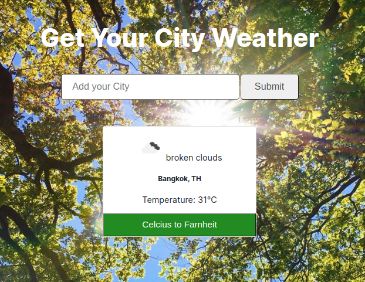
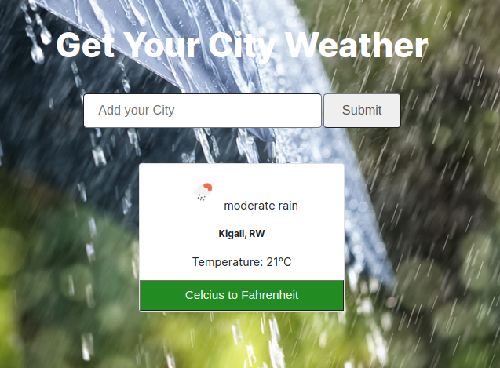

# Weather_app

This project is about creating a weather forecast site using OpenWeatherMap API and it let you get the weather of any city in the world.

# Sunny Day


# Rainy Day



## Live Demo

Click [here](https://delicelydia.github.io/Weather_app/)

## Features

A user is able to:

- Search by providing a city name
- Get a temperature of that city
- See a country that city belongs to
- Get temperature in celcius or in Fahrenheit

## Built With

- Javascript
- Webpack
- HTML
- CSS

## Getting Started

* Clone this repo
    ```
    git clone git@github.com:DeliceLydia/Weather_app.git
    ```
* Navigate to Weather_app folder
    ```
    cd Weather_app
    ```
* On the terminal, while in the 'Weather_app' directory:

* Run ``` git checkout feature-branch ```

* Run ``` git pull origin feature-branch ```

* Run ``` yarn install ``` or ``` npm install``` to install dependencies

* Run ``` npm run dev ```
   
* Go to the browser and enter 
    ```http://127.0.0.1:5500/dist/index.html``` and you are now able to visit the app

## Author

👤 **Delice Lydia**
  - GitHub: [Delice Lydia](https://github.com/DeliceLydia)
  - Twitter: [Delice](https://twitter.com/IngabireLydia3)
  - LinkedIn: [Delice Lydia](https://www.linkedin.com/in/delice-lydia/)

## Contribution

- Clone the repo using the above instructions
- Create a new branch: `git checkout -b awesome branch`
- Add your changes and commit the file
- Push to your forked repo
- Make a pull request to `develop` branch

## Show your support

Give a ⭐️ if you like 

## License

This project is [MIT](https://github.com/DeliceLydia/Weather_app/blob/master/LICENSE) licensed
