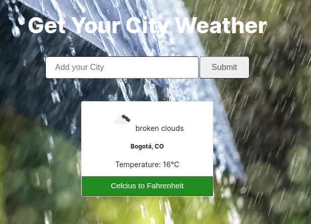

# Weather_app

This project is about creating a weather forecast site using OpenWeatherMap API and it let you get a weather of any city in the world.

## Features

A user is able to:

- Search by providing a city name
- Get a temperature of that city
- See a country that city belongs to
- Get temperature in celcius or in Fahrenheit
